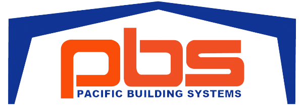

# PBS Dealer App



## Getting Started

First, install all your dependencies

```bash
npm install --save-dev prettier eslint-plugin-prettier eslint-config-prettier nodemon concurrently @types/bcrypt three @types/three

npm install -save express jsonwebtoken bcryptjs dotenv
@fortawesome/fontawesome-free @fortawesome/fontawesome-svg-core @fortawesome/react-fontawesome @fortawesome/free-solid-svg-icons next-pwa next react react-dom next-auth bcrypt mariadb
```

Next, run the development server to ensure it is working:

```bash
npm run dev
# or
yarn dev
# or
pnpm dev
# or
bun dev
```

Open [http://localhost:3000](http://localhost:3000) with your browser to see the result.

This project uses [`next/font`](https://nextjs.org/docs/basic-features/font-optimization) to automatically optimize and load Inter, a custom Google Font.

## Deploy on Vercel

This application is deployed through Vercel and will automatically update when changes are merged to the master branch
